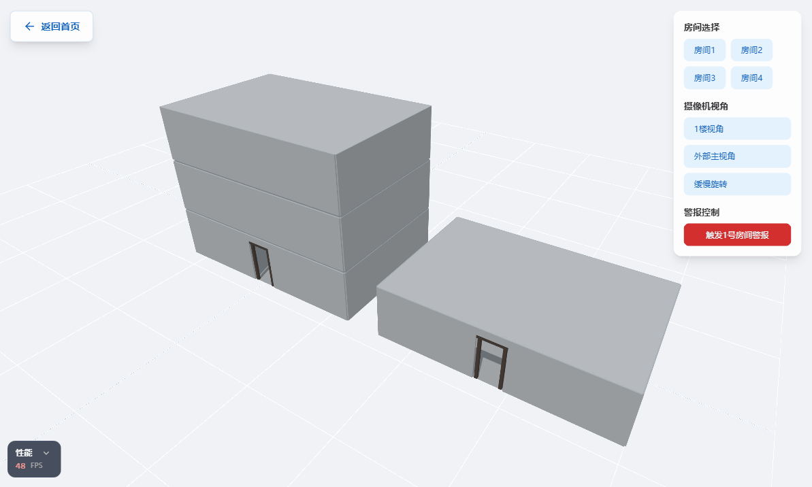
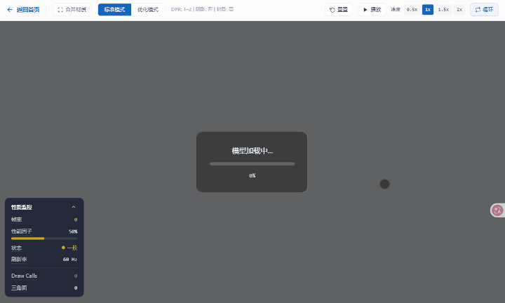

# 🧪 Three.js Scene Lab

[](https://react.dev/)
[](https://www.typescriptlang.org/)
[](https://threejs.org/)
[](https://vitejs.dev/)
[](https://tailwindcss.com/)

> 基于 **React Three Fiber + Three.js** 的 Web3D 工程实践场景集，覆盖空间建模、GLTF/Draco 模型加载、PBR 材质渲染、Draw Call 合并优化、实时性能监控与 GLTF 导出等核心开发场景，可作为 Web3D 项目工程化的参考起点或技术评审用例。

---

## 🎬 效果预览

### 多房间诊所场景 — 交互 · 高亮 · 相机预设



> 点击房间聚焦 + 其余房间淡出 · 悬停 Outline 描边高亮 · 相机预设 Lerp 平滑切换

### GLTF 车模展示 — 加载 · 性能监控 · 动画控制



> Draco 压缩解码加载 · 双模式性能对比（标准 / 优化）· FPS / Draw Call / 三角面实时监控

---

## ✨ 功能特性

### M1 — 3D 空间场景基础

- **程序化建模** — 基于 `BufferGeometry` 构建 12×8m 室内空间（地板/墙体/半透明天花板）
- **组合式家具** — L 形接待台、可配置排数候诊椅、入口门框，支持参数化复用
- **OrbitControls 交互** — 旋转、缩放、平移全支持
- **三光源系统** — 环境光 + 定向光（含 PCF 阴影贴图）+ 半球光

### M2 — 多实例交互与后期处理

- **4 房间实例化布局** — 相同组件多实例独立状态管理
- **透明度淡出动画** — `useFrame` + `MathUtils.lerp` 实现选中/非选中平滑过渡
- **发光报警效果** — 基于 `emissive` 通道的正弦波闪烁动画
- **Outline 描边高亮** — `@react-three/postprocessing` EffectComposer 后期处理管线
- **相机预设系统** — 多视角预设 + Lerp 平滑切换，Zustand 全局状态驱动
- **细粒度状态订阅** — Zustand selector 按需订阅，避免无关组件重渲染

### M3 — GLTF 模型加载与渲染优化

- **GLTF/Draco 加载 Hook** — 封装 `GLTFLoader` + `DRACOLoader`（本地解码器，无 CDN 依赖），React Suspense 模式
- **同材质 Mesh 合并** — 基于材质 UUID + Attribute 指纹分桶，`mergeGeometries` 批量合并，降低 Draw Call
- **双模式性能降级** — Standard（全质量）/ Optimized（剥离法线/AO/位移贴图，降低 DPR，关闭阴影），WeakMap 缓存原始材质支持无损可逆切换
- **实时性能仪表盘** — FPS、性能因子、Draw Call、三角面数实时展示，状态分级着色（良好/一般/较差）
- **动画播放控制** — `AnimationMixer` 封装 Hook，支持播放/暂停/速度/循环独立控制

### 扩展 — 模型画廊与 GLTF 导出

- **多 Canvas 缩略图画廊** — 每个模型独立旋转预览，模型注册表统一管理
- **GLTFExporter 集成** — 一键导出 GLTF（JSON）/ GLB（二进制），Blob 流式下载
- **导出内容可选** — 网格、材质、动画、灯光按需勾选

---

## 🗺️ 页面路由

| 路径 | 页面 | 说明 |
|------|------|------|
| `/` | 首页 | 项目导航入口 |
| `/clinic` | 诊所场景页 | 多房间 3D 诊所监控场景 |
| `/car-model` | 车模展示页 | GLTF 车模加载与性能对比 |
| `/export` | 导出页 | 模型画廊与 GLTF/GLB 导出工具 |

---

## 🛠️ 技术栈

| 技术 | 版本 | 说明 |
|------|------|------|
| [Vite](https://vitejs.dev/) | ^8.0.8 | 构建工具 |
| [React](https://react.dev/) | ^19.2.5 | UI 框架 |
| [TypeScript](https://www.typescriptlang.org/) | ^6.0.2 | 类型系统 |
| [Three.js](https://threejs.org/) | ^0.183.2 | 3D 渲染引擎 |
| [@react-three/fiber](https://docs.pmnd.rs/react-three-fiber) | ^9.6.0 | React 渲染器 |
| [@react-three/drei](https://github.com/pmndrs/drei) | ^10.7.7 | 辅助组件库 |
| [@react-three/postprocessing](https://github.com/pmndrs/react-postprocessing) | ^3.0.4 | 后期处理效果 |
| [Zustand](https://github.com/pmndrs/zustand) | ^5.0.12 | 状态管理 |
| [React Router DOM](https://reactrouter.com/) | ^7.14.1 | 客户端路由 |
| [Tailwind CSS](https://tailwindcss.com/) | ^4.2.2 | 原子化 CSS |

---

## 🚀 快速开始

### 环境要求

- Node.js 18+
- pnpm（推荐）/ npm / yarn

### 安装与运行

```bash
# 克隆项目
git clone <repository-url>
cd threejs-room-setup

# 安装依赖
pnpm install

# 启动开发服务器
pnpm dev
```

应用将在 `http://localhost:5173` 启动。

### 构建与预览

```bash
# 生产构建
pnpm build

# 预览生产构建
pnpm preview
```

---

## 📁 项目结构

```
threejs-room-setup/
├── public/
│   ├── draco/gltf/               # Draco 解码器（GLTF 压缩支持）
│   ├── environments/             # HDR 环境贴图
│   └── models/                   # GLTF 模型资源
│       ├── 2021_bmw_m4_competition/
│       └── bmw_m4_widebody/
├── src/
│   ├── components/
│   │   ├── CarModel/             # 车模组件
│   │   ├── PerformanceMonitor/   # 性能监控仪表盘组件
│   │   └── Room/                 # 诊所房间组件集
│   │       ├── Room.tsx          # 主房间组件（含家具组合）
│   │       ├── RoomShell.tsx     # 纯房间外壳（地板/墙/天花板）
│   │       ├── ReceptionDesk.tsx # 接待台
│   │       ├── WaitingChairs.tsx # 候诊椅
│   │       └── DoorFrame.tsx     # 入口门框
│   ├── hooks/
│   │   ├── useModelLoader.ts     # GLTF 模型加载 Hook
│   │   ├── usePerformanceMode.ts # 性能模式切换 Hook
│   │   └── useAnimationPlayer.ts # 动画播放控制 Hook
│   ├── pages/
│   │   ├── HomePage.tsx          # 首页
│   │   ├── ClinicPage.tsx        # 诊所监控页
│   │   ├── CarModelPage.tsx      # 车模展示页
│   │   └── ExportPage.tsx        # 模型导出页
│   ├── scene/
│   │   ├── ClinicScene.tsx       # 多房间诊所 3D 场景
│   │   └── CameraController.tsx  # 相机预设控制器
│   ├── store/
│   │   ├── useClinicStore.ts     # 诊所场景状态
│   │   └── usePerformanceStore.ts# 性能监控状态
│   ├── utils/
│   │   ├── gltfExporter.ts       # GLTF 导出工具
│   │   └── modelRegistry.tsx     # 模型注册表
│   ├── App.tsx                   # 路由配置与应用入口
│   ├── main.tsx                  # 渲染入口
│   └── index.css                 # 全局样式（Tailwind CSS v4）
├── package.json
├── tsconfig.json
├── vite.config.ts
└── AGENT.md                      # AI 开发约束规范
```

---

## 🎓 通过本项目你能学到什么

本项目涵盖多个典型 Web 3D 开发场景，适合以下方向的开发者参考学习：

| 技术场景 | 涉及知识点 | 对应页面 |
|----------|-----------|---------|
| **3D 场景搭建** | BufferGeometry 组合建模、光照系统（环境光/定向光/半球光）、阴影贴图 | 诊所场景 |
| **场景交互控制** | OrbitControls 鼠标交互、相机位置 Lerp 平滑过渡、多个预设视角切换 | 诊所场景 |
| **后期处理效果** | `@react-three/postprocessing` Outline 描边高亮、EffectComposer 组合 | 诊所场景 |
| **实例化渲染** | `<instancedMesh>` 声明式批量渲染、减少 DrawCall | 诊所场景 |
| **GLTF 模型加载** | `useGLTF` 缓存加载、DRACOLoader 压缩解码、加载进度回调 | 车模展示 |
| **性能监控与优化** | FPS / 内存 / DrawCall / 三角面实时采集、双模式 LOD 切换、材质降级 | 车模展示 |
| **动画播放控制** | `AnimationMixer`、播放 / 暂停 / 切换动画片段的 Hook 封装 | 车模展示 |
| **GLTF 场景导出** | `GLTFExporter` 导出流程、Blob 文件下载、多格式（GLTF / GLB）支持 | 导出工具 |
| **3D 缩略图渲染** | 多 Canvas 独立场景、旋转预览、模型注册表模式 | 导出工具 |
| **Zustand 状态管理** | 多组件共享 3D 场景状态、低频 UI 状态与高频 ref 更新的分离策略 | 全局 |
| **React Router 路由** | 路由驱动的多页面架构、懒加载与 Suspense 配合 | 全局 |
| **Tailwind CSS v4** | 原子化样式与内联动态颜色混用、暗色/亮色主题适配 | 全局 |

---

## 🗺️ 里程碑进度

- [x] **里程碑 1** — 3D 诊所基础场景（房间、家具、光照、交互控制）
- [x] **里程碑 2** — 多房间交互系统（4 房间布局、报警、高亮、相机预设、Zustand 状态管理）
- [x] **里程碑 3** — GLTF 模型加载与性能优化（车模展示、双模式对比、实时性能监控仪表盘）
- [x] **扩展功能** — 模型画廊导出页（缩略图预览、GLTF/GLB 一键导出）

---

## 📄 许可证

[MIT](LICENSE)

---

*Built with React Three Fiber + Three.js*
